# RevPRAG
We are excited to share the code and datasets from our study on the RevPRAG, making them publicly available for further research and development.

# Models Used
Our experiments leverage several Large Language Models (LLMs) and retrievers from Huggingface, a reputable platform hosting a diverse array of LLMs. The specific models utilized in our study include:
## LLMs
- GPT2-XL：[View on Huggingface](https://huggingface.co/openai-community/gpt2-xl)
- Llama-2-7B：[View on Huggingface](https://huggingface.co/meta-llama/Llama-2-7b-hf)
- Mistral-7B：[View on Huggingface](https://huggingface.co/mistralai/Mistral-7B-v0.1)
- Llama-3-8B：[View on Huggingface](https://huggingface.co/meta-llama/Llama-3.1-8B-Instruct)
- Llama-2-13B：[View on Huggingface](https://huggingface.co/meta-llama/Llama-2-13b-chat-hf)
## retrievers
- contriever：[View on Huggingface](https://huggingface.co/facebook/contriever)
- contriever-msmarco：[View on Huggingface](https://huggingface.co/facebook/contriever-msmarco)
- dpr-multi：[View on Huggingface](https://huggingface.co/facebook/dpr-ctx_encoder-multiset-base)
- ance：[View on Huggingface](https://huggingface.co/sentence-transformers/msmarco-roberta-base-ance-firstp)

# Computational Environment

# Dataset and Codebase

# Code Files

# Replicating Our Experiments

